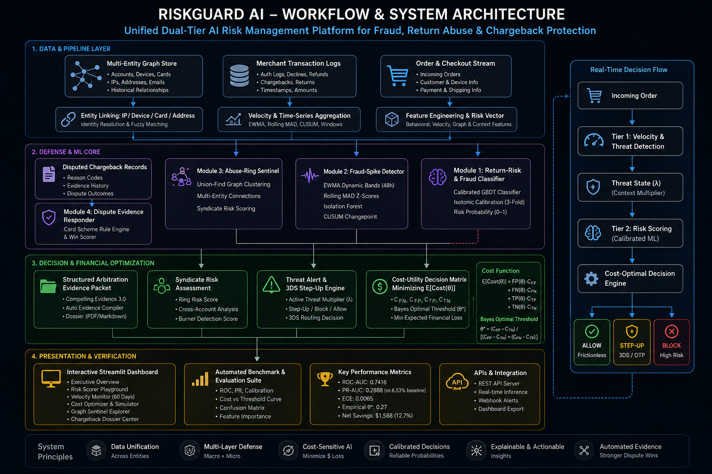
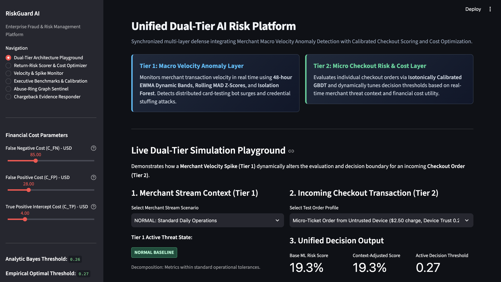
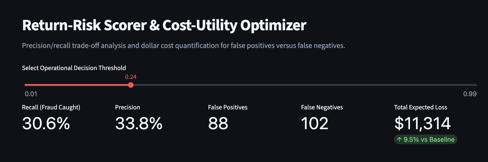
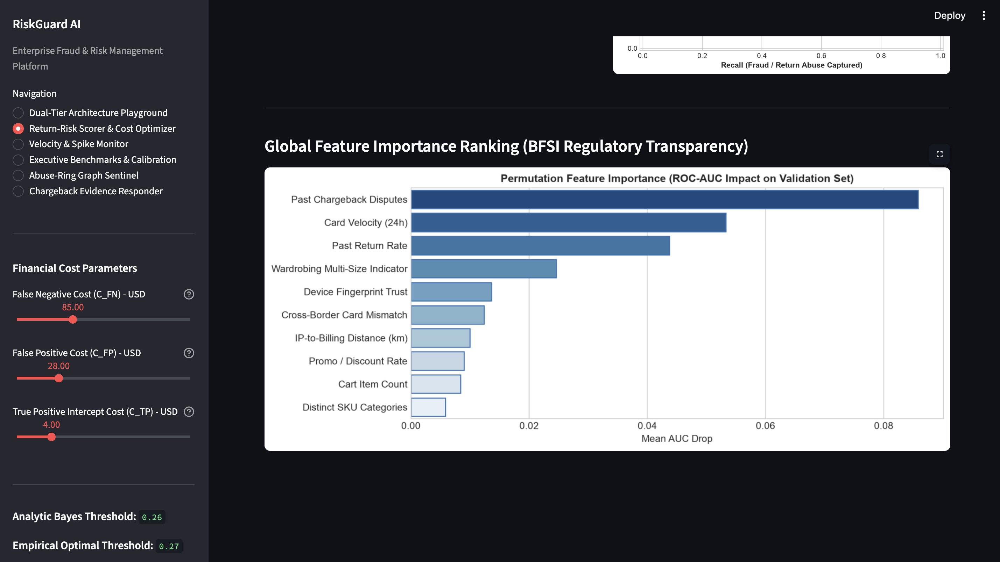
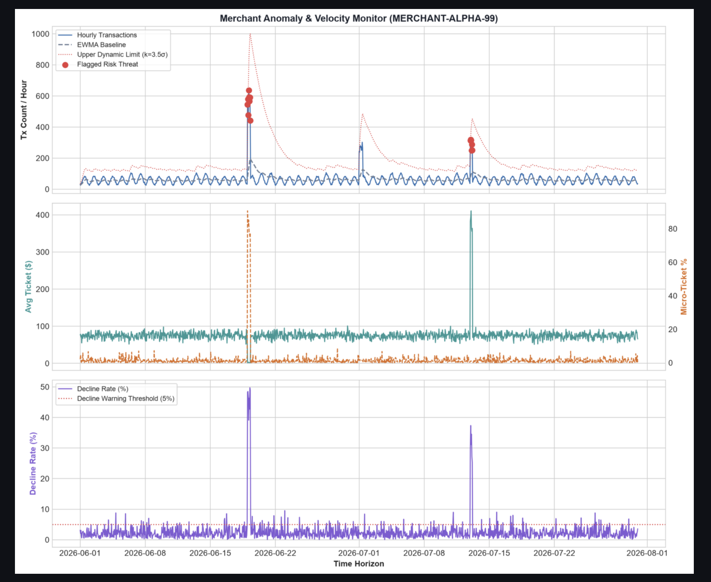
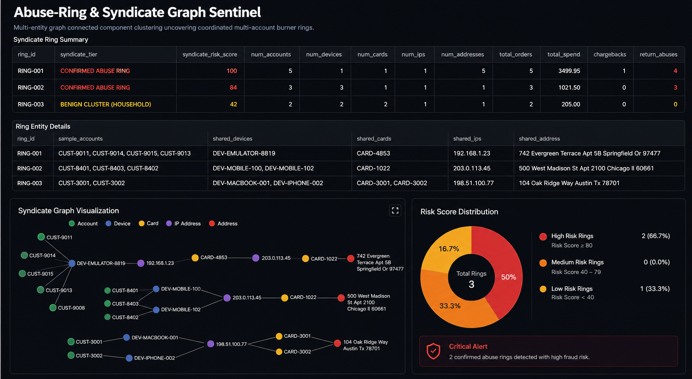
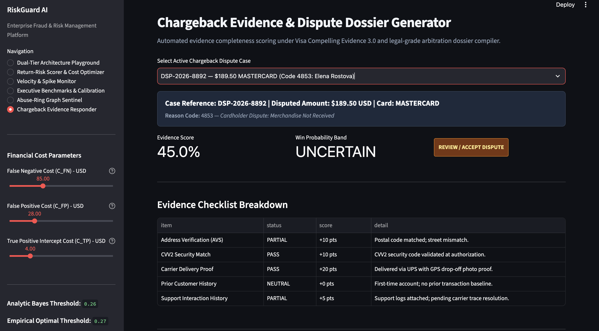
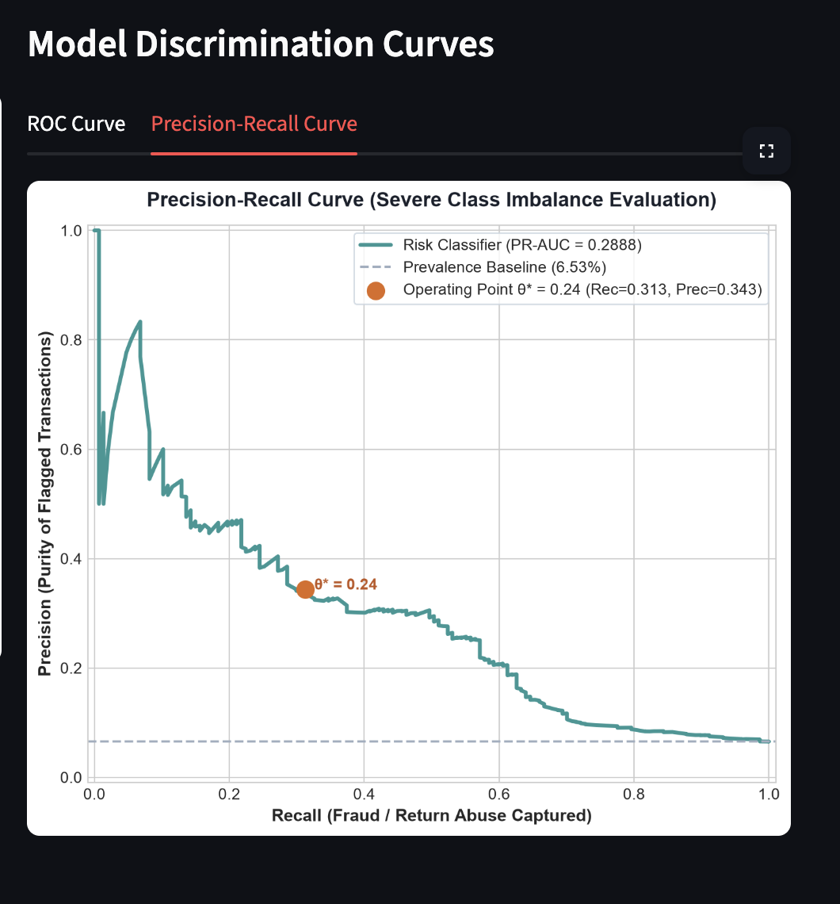
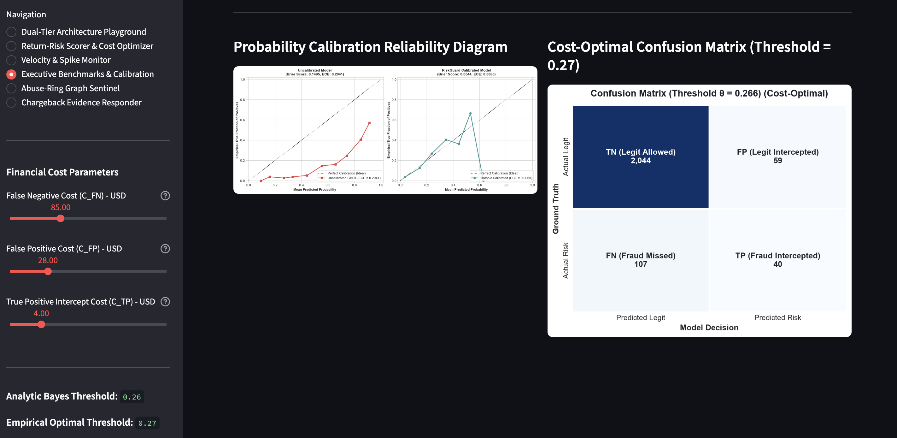
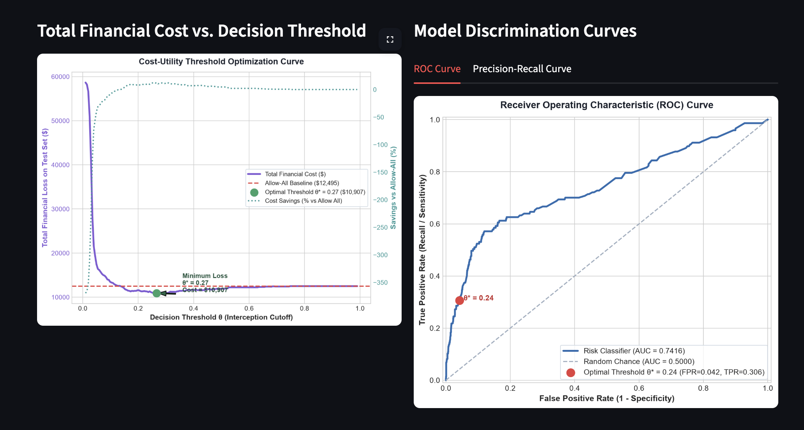

#  RiskSentinel AI
### **Defensive AI for Fraud, Abuse & Financial Risk**

> A dual-tier AI risk platform combining **calibrated ML, velocity analytics, graph intelligence, and cost-aware decisioning** to reduce fraud losses while minimizing legitimate-customer friction.
**RiskSentinel AI → Detect → Score → Connect → Optimize → Decide**
---
## Introduction: What is RiskSentinel AI?
**RiskSentinel AI** is an enterprise-grade, autonomous risk intelligence platform engineered to protect payment gateways, merchant ecosystems, and e-commerce platforms from sophisticated fraud, return abuse, and chargeback penalties.
Traditional fraud detection tools operate in silos: they score an isolated checkout transaction with an arbitrary `0.50` threshold and make a binary **"Fraud vs. Not Fraud"** guess. In reality, this approach breaks down because:
1. **Context is Ignored:** A normal \$5.00 order becomes dangerous if the merchant is under an active card-testing bot attack.
2. **Costs are Asymmetric:** Blocking a legitimate \$100 customer (False Positive) destroys profit margin and Customer Lifetime Value (CLTV), while missing a stolen card (False Negative) triggers an irreversible \$15 chargeback fine plus merchandise loss.
3. **Syndicates Coordinate:** Bad actors rotate burner devices, proxy IPs, and modified street addresses to evade single-order detection.
### How RiskSentinel AI Works
RiskSentinel AI addresses these challenges through a **Unified Dual-Tier Architecture**:
1. **Macro Merchant Velocity Layer (Tier 1):** Ingests real-time transaction streams to detect abnormal velocity spikes, card-testing bot floods, and credential stuffing using 48-hour EWMA dynamic confidence bands, rolling robust z-scores, and Isolation Forest anomaly models.
2. **Micro Checkout Scoring Layer (Tier 2):** Evaluates individual order features using an Isotonically Calibrated Gradient Boosted Decision Tree (GBDT) that guarantees output scores reflect true empirical probabilities ($ECE < 0.7\%$).
3. **Dynamic Threat Context Bus:** Connects Tier 1 and Tier 2 so that active merchant-level attacks dynamically tighten checkout thresholds for suspicious devices, while verified flash sales preserve frictionless checkout.
4. **Abuse-Ring Graph Sentinel:** Uses Disjoint Set Union (DSU / Union-Find) and fuzzy street address normalization to cluster multi-account collusion sharing hardware emulators and payment instruments.
5. **Chargeback Evidence Responder:** Evaluates disputed transactions against Visa Compelling Evidence 3.0 rules and auto-generates structured, legal-grade arbitration rebuttal dossiers.
---

## System Architecture

*End-to-end dataflow linking raw transaction telemetry, multi-tier defense modules, probability calibration, cost optimization, and automated dispute resolution.*

*Real-time synchronization between Tier 1 Macro Merchant Velocity threat states and Tier 2 Micro Checkout order scoring.*

---

## Core Risk Engine

| Module | What It Does | Key Technology |
|---|---|---|
| **Return-Risk Scorer** | Evaluates order-level risk and wardrobing signatures | Calibrated GBDT + Isotonic Regression |
| **Velocity Monitor** | Detects merchant volume surges and bot attacks | 48h EWMA + Rolling MAD + CUSUM |
| **Graph Sentinel** | Uncovers coordinated fraud and scalper rings | Disjoint Set Union (DSU) + Fuzzy Address Normalization |
| **Cost Optimizer** | Balances false positives vs. false negatives to find $\theta^*$ | Bayes Decision Theory + Cost-Utility Matrix |
| **Chargeback AI** | Scores dispute evidence and generates arbitration packets | Visa Compelling Evidence 3.0 Rule Engine |

---

## 01 — Return-Risk & Cost Optimization

Calibrated GBDT scoring combined with cost-sensitive threshold optimization to minimize net financial loss.

*Interactive slider adjusting decision threshold $\theta$ to dynamically evaluate recall, precision, and dollars saved.*

### Model Explainability

Permutation feature importance ensures full regulatory transparency and auditability for risk operations.

*Top feature contributors: past chargeback frequency, card velocity, return rate history, and device trust scores.*

---

## 02 — Merchant Velocity & Fraud-Spike Detection

Monitors transaction stream velocity in real time using statistical envelopes and anomaly detection to discriminate bot floods from legitimate promos.

*60-day telemetry displaying EWMA volume envelopes, ticket sizes, and decline rates—flagging card testing with 0 false alarms on organic flash sales.*

---

## 03 — Abuse-Ring Graph Sentinel

Discovers hidden syndicate infrastructure by linking **accounts, hardware devices, IPs, cards, and delivery addresses**.

*Connected component clustering showing multi-account clusters sharing emulator hardware, IPs, and normalized fuzzy addresses.*

---

## 04 — Chargeback Evidence Intelligence

Transforms transaction history, delivery tracking, and communication logs into structured arbitration dossiers under Visa CE 3.0 rules.

*Automated evidence scoring, win probability estimation, and exportable formal arbitration rebuttal packets.*

---

# ML Evaluation & Benchmarks

RiskSentinel evaluates model performance beyond simple accuracy, measuring **ROC-AUC, Precision-Recall, Probability Calibration, Confusion Matrices, and Total Expected Dollar Cost** on a held-out test set (2,250 unseen transactions).

### Precision–Recall Analysis

Evaluates fraud interception under realistic severe class imbalance (6.53% risk prevalence).

*Precision-Recall Curve achieving PR-AUC = 0.2888 compared to the 6.53% random prevalence baseline.*

---

### Probability Calibration & Cost-Optimal Confusion Matrix

Ensures predicted scores match real-world empirical risk likelihood ($ECE < 0.7\%$) to power downstream cost optimization.

*Reliability diagram showing Expected Calibration Error (ECE) drop from 0.2941 to 0.0065 via Isotonic Calibration, paired with the optimal confusion matrix.*

---

### Financial Cost & ROC Analysis

Plots expected financial loss across all potential decision cutoffs to identify the empirical minimum-cost operating threshold.

*Total Expected Financial Loss curve reaching optimal minimum at $\theta^* = 0.27$, paired with ROC Curve (AUC = 0.7416).*

---

## Held-Out Test Set Performance Comparison

| Decision Policy | Threshold $\theta$ | Recall (Fraud Caught) | Precision (Purity) | False Positives | False Negatives | Total Financial Loss | Net Dollar Savings |
|---|:---:|:---:|:---:|:---:|:---:|:---:|:---:|
| **1. Allow All (Baseline)** | `1.00` | 0.0% | 0.0% | 0 | 147 | $12,495 | $0 (0.0%) |
| **2. Block All (Over-conservative)** | `0.00` | 100.0% | 6.5% | 2,103 | 0 | $59,472 | -$46,977 (-376.0%) |
| **3. Default ML Classifier** | `0.50` | 5.4% | 80.0% | 2 | 139 | $11,903 | +$592 (+4.7%) |
| **4. Theoretical Bayes Model** | `0.26` | 28.6% | 38.5% | 67 | 105 | $10,969 | +$1,526 (+12.2%) |
| **5. RiskSentinel Optimal ML** | **`0.27`** | **27.2%** | **40.4%** | **59** | **107** | **$10,907** | **+$1,588 (+12.7%)** |
| **6. Naive Rule Engine** | `N/A` | 11.6% | 23.3% | 56 | 130 | $12,686 | -$191 (-1.5%) |

---

## Cost-Aware Decisioning

Traditional fraud systems ask:

> **“Is this transaction risky?”**

RiskSentinel asks:

> **“Which decision minimizes expected financial loss?”**

The engine balances:

$$\text{Total Expected Loss} = \text{FP} \cdot C_{\text{FP}} + \text{FN} \cdot C_{\text{FN}} + \text{TP} \cdot C_{\text{TP}} + \text{TN} \cdot C_{\text{TN}}$$

Where:
- **False Negative Cost (`C_FN` = \$85.00):** Missed fraud (merchandise loss + \$15 dispute fee + return shipping loss).
- **False Positive Cost (`C_FP` = \$28.00):** Legitimate customer blocked (lost profit margin + customer churn).
- **True Positive Intercept Cost (`C_TP` = \$4.00):** Step-up authentication (3DS / OTP verification challenge) friction cost.
- **True Negative Cost (`C_TN` = \$0.00):** Frictionless completed transaction (ideal customer outcome).

Analytically derived **Bayes-Optimal Operating Threshold**:

$$\theta^* = \frac{C_{\text{FP}} - C_{\text{TN}}}{(C_{\text{FP}} - C_{\text{TN}}) + (C_{\text{FN}} - C_{\text{TP}})} = \frac{28}{28 + 85 - 4} \approx \mathbf{0.26}$$

Transactions are routed through three operational outcomes:
- 🟢 **ALLOW:** Low risk, frictionless checkout.
- 🟡 **STEP-UP:** Moderate risk, triggered 3DS / OTP verification.
- 🔴 **BLOCK:** Critical risk, automated transaction intercept.

---

## Technology Stack

| Layer / Category | Technology / Library | Purpose & Usage |
|---|---|---|
| **Core Language** | `Python 3.13.3` | Primary programming language across all modules |
| **Machine Learning** | `Scikit-Learn` (`HistGradientBoostingClassifier`, `RandomForestClassifier`) | Gradient boosted decision trees for checkout return-risk scoring |
| **Probability Calibration** | `CalibratedClassifierCV` (Isotonic Regression) | Calibrates posterior risk probabilities to reduce ECE to `< 0.7%` |
| **Anomaly Detection** | `IsolationForest` + Custom `EWMA` & `Rolling MAD` | Multivariate velocity anomaly & card-testing bot detection |
| **Changepoint Detection** | Custom `CUSUMDetector` | Statistical early shift detection in transaction rate telemetry |
| **Graph Intelligence** | Custom `DisjointSetUnion` (DSU / Union-Find) | Connected-component clustering of burner devices, IPs, & cards |
| **Text & Normalization** | Python `re` Regex Tokenizer | Fuzzy street address parsing & abbreviation deduplication |
| **Data Processing** | `Pandas`, `NumPy`, `SciPy` | High-performance feature engineering & matrix transformations |
| **Visualization** | `Matplotlib`, `Seaborn` | Publication-grade ROC, PR, cost curves, and reliability diagrams |
| **User Interface** | `Streamlit` | Interactive 6-tab executive dashboard & simulation playground |
| **API Framework** | Native Python HTTP (`api.py`) | Zero-dependency, lightweight REST API for microservice integration |
| **Quality Assurance** | Python `unittest` | Automated verification test suite (7/7 unit & integration tests) |

---

## Key Advantages

1. **Synchronized Multi-Layer Defense:** Integrates macro merchant velocity monitoring, micro order probability scoring, graph syndicate clustering, and automated chargeback intelligence.
2. **Mathematically Grounded Cost Decisions:** Formulates a real-world Cost-Utility Matrix (`C_FP` vs. `C_FN`) to analytically compute the Bayes-optimal threshold $\theta^*$, preventing arbitrary `0.50` threshold failures.
3. **Adaptive Threat Context Bus:** Real-time macro merchant bot attacks automatically tighten checkout thresholds for unverified devices while protecting frictionless checkout during legitimate sales.
4. **Isotonic Probability Calibration:** Reduces Expected Calibration Error (ECE) from `0.2941` to `0.0065`, ensuring risk scores reflect true empirical likelihoods.
5. **Explainability by Design:** Produces permutation feature importance rankings and human-readable audit factor logs for BFSI compliance and risk analyst review.
6. **Syndicate & Abuse-Ring Discovery:** Graph connected components uncover coordinated multi-account collusion sharing burner emulators, proxy IPs, and modified postal addresses.
7. **Automated Dispute Resolution:** Synthesizes transaction tracking, customer communication transcripts, and AVS/CVV matching into formal arbitration rebuttal dossiers under Visa Compelling Evidence 3.0.
8. **Customer-Centric Tri-State Routing:** Supports `ALLOW` (frictionless), `STEP-UP` (3DS / OTP verification challenge), and `BLOCK` (fraud intercept) to eliminate unnecessary customer insult.

---

## Security & Compliance

RiskSentinel AI is built strictly as a **defensive security intelligence tool**:

- **Privacy-Preserving & Tokenized Data:** Operates entirely on anonymized features, hashed card footprints, and tokenized customer identifiers without exposing raw PANs or sensitive CVVs.
- **Card Scheme Compliance:** Strictly adheres to Visa Compelling Evidence 3.0 and Mastercard Dispute Resolution rules for legal arbitration preparation.
- **No Offensive Capabilities:** Contains zero offensive penetration scripts, web scrapers, or vulnerability exploit tools—strictly dedicated to passive defense and risk mitigation.
- **Algorithmic Transparency:** Built with interpretable models (EWMA, Rolling MAD, permutation importance) to satisfy BFSI regulatory auditability and anti-discrimination standards.
